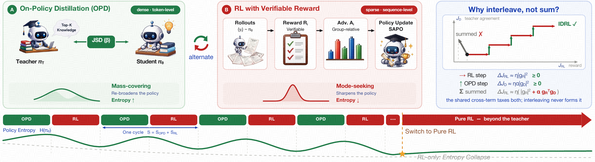
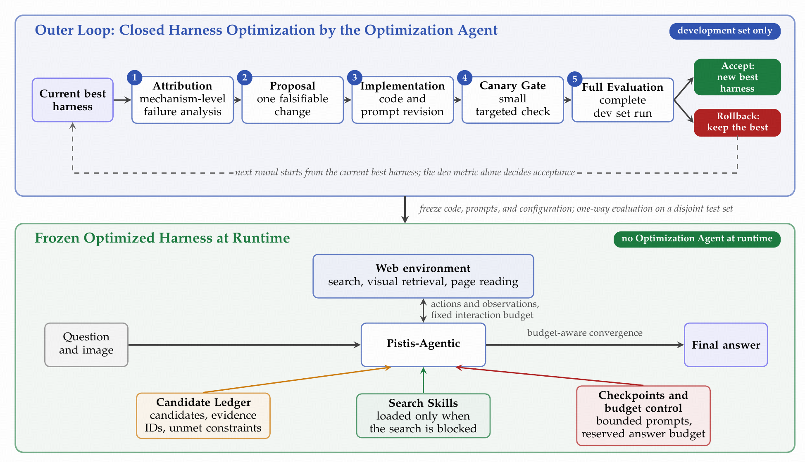

<h1 align="center">Pistis</h1>

<p align="center"><strong>Reason deeply, Search broadly, Act with evidence.</strong></p>
<p align="center">Pistis Team · ByteDance</p>

<p align="center">
  <a href="https://pististeam.github.io/"><strong>Project Page</strong></a>
  &nbsp;·&nbsp;
  <a href="https://arxiv.org/abs/2609.28554"><strong>Paper on arXiv</strong></a>
</p>

## Overview

Pistis is a family of **27B and 9B multimodal models** for visual understanding, reasoning, search, and long-horizon interaction, built on Qwen3.6-27B and Qwen3.5-9B. Both scales offer two complementary variants:

- **Pistis-Thinking** specializes in multimodal understanding and reasoning.
- **Pistis-Agentic** adds search, planning, tool use, and long-horizon interaction.

## Interleaved Distillation and Reinforcement Learning (IDRL)

IDRL trains the 9B students by alternating on-policy guidance from 27B teachers with reward-driven updates, then finishes with pure reinforcement learning. Separate updates transfer knowledge while preserving useful exploration.

<p align="center">
  
</p>

## Pistis-Auto-Harnessing (PAH)

PAH improves the agent harness around a **frozen model**. An Optimization Agent refines evidence management, recovery, and execution on development tasks; the selected harness is then frozen for evaluation and inference.

<p align="center">
  
</p>

Explore benchmark comparisons, held-out harness evaluation, and ablation studies on the [project page](https://pististeam.github.io/).

## Citation

```bibtex
@misc{chen2026pististechnicalreport,
  title={Pistis Technical Report},
  author={Heyun Chen and Xiaohan Lan and Jiaxi Li and Zhilin Lu and Qi She
          and Weiwen Xu and Fei Yu and Yujie Zhong and Jinghuan Chen
          and Zijian Feng and Siyu Jiao and Yiheng Lin and Xinhao Wang
          and Sihan Yang and Jieyu You and Changbin Zhang and Hengyu Zhang
          and Xudong Zhang and Yunqing Zhao and Shuai Zheng},
  year={2026},
  eprint={2609.28554},
  archivePrefix={arXiv},
  primaryClass={cs.AI},
  url={https://arxiv.org/abs/2609.28554},
}
```
